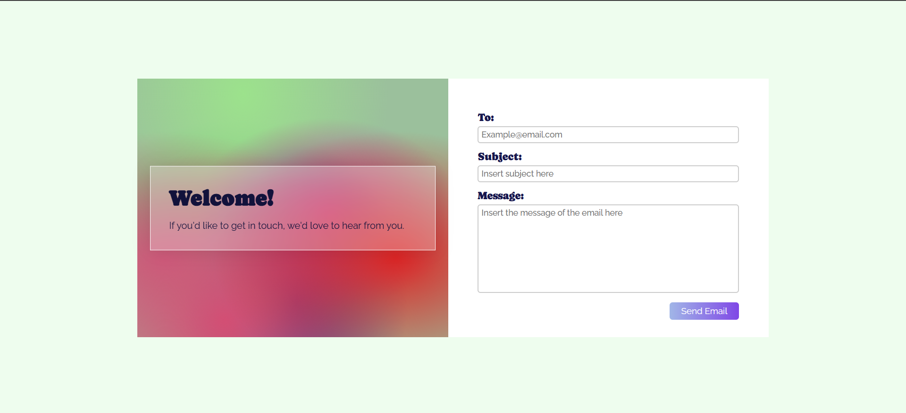

# EmailSenderApp

✉️ A lightweight Email Sender App built with HTML, CSS, and JavaScript for sending emails easily via [EmailJS](https://www.emailjs.com/).

## Features

- Simple and modern UI
- Send emails directly from the browser using EmailJS
- Responsive design for desktop and mobile
- No backend required

## Folder Structure

- **index.html**: Main HTML file containing the app structure and form.
- **style.css**: Stylesheet for the app's appearance and responsive design.
- **script.js**: JavaScript logic for sending emails using EmailJS.
- **sender.png**: Favicon/logo for the app.
- **preview.png**: Screenshot preview of the app.
- **README.md**: This documentation file.

## Getting Started

### Prerequisites

- [EmailJS account](https://www.emailjs.com/)
- Public Key, Service ID, and Template ID from your EmailJS dashboard

### Usage

- Enter the recipient's email address, subject, and message.
- Click the "Send Email" button.
- Check the recipient's inbox for the email.

### Troubleshooting

- Ensure all fields are filled correctly.
- Check your internet connection.
- Verify your EmailJS configuration and credentials.
